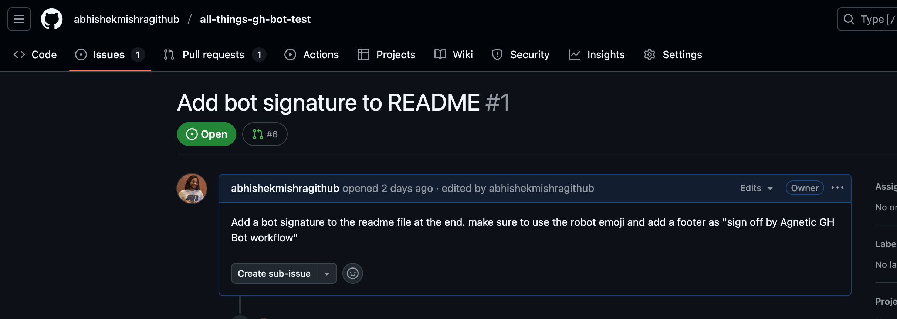
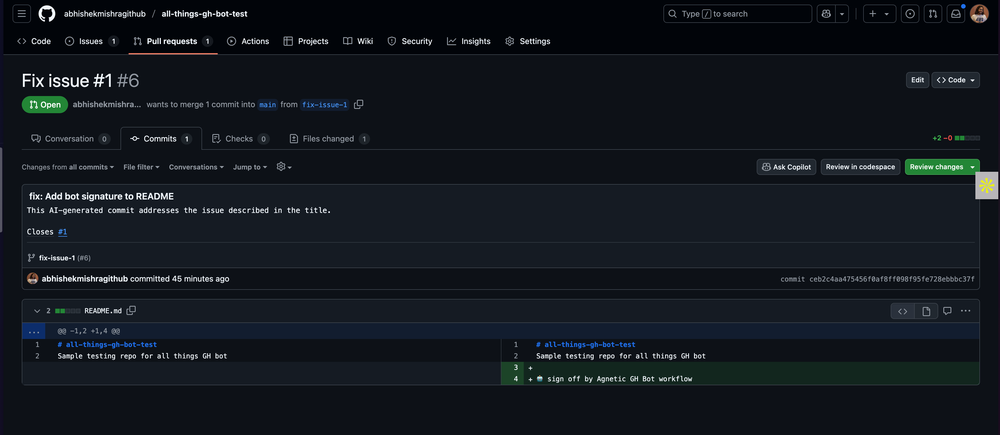
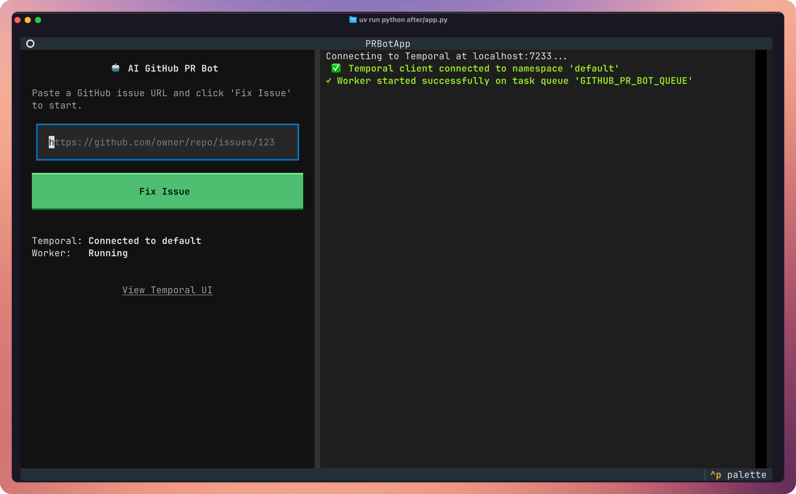

# AI-Powered GitHub PR Bot

An AI agent that autonomously fixes issues in a GitHub repository. Simply provide a URL to a GitHub issue, and this bot will analyze the problem, generate a code fix using Google's Gemini model, and submit a pull request—all within a resilient Temporal workflow that guarantees execution and cleanup.

## Features

- **🤖 AI-Powered Fixes**: Uses Google's Gemini to understand issue descriptions and generate relevant code changes.
- **⚡ Resilient Execution**: Powered by Temporal, it provides automatic retries with exponential backoff for network or API failures.
- **✅ Reliable Cleanup**: Guarantees that local repository clones are always removed, even if the workflow fails.

## Demo: From Issue to Pull Request

The agent takes a GitHub issue as input and automatically generates a pull request with the fix. [This repo](https://github.com/abhishekmishragithub/all-things-gh-bot-test) was my test repo for the demo.

*(Note: For this demo, the agent is configured to fix issues in the `README.md` file. See "Current Scope" below for more details.)*

**1. You start with a GitHub Issue:**



**2. The AI Agent Creates a Pull Request:**

After running the workflow, the bot creates a pull request with the generated code fix, a descriptive title, and a link back to the original issue.



## Quick Start

### Prerequisites

-   [uv](https://github.com/astral-sh/uv) package manager
-   Docker and Docker Compose (for the Temporal server)
-   **GitHub Personal Access Token** with `repo` scope.
-   **Google Gemini API Key**.

### Setup

1.  **Install Dependencies**

    ```bash
    uv sync
    ```

2.  **Start Temporal Server**

    ```bash
    docker-compose up -d
    ```

3.  **Set Environment Variables**

    Create a `.env` file or export the following variables in your terminal. The `GEMINI_API_KEY` can also be set as `GOOGLE_API_KEY`.

    ```bash
    # Required
    export GITHUB_TOKEN="ghp_your_github_token"
    export GEMINI_API_KEY="your_gemini_api_key_here"

    # Optional
    export TEMPORAL_ADDRESS="localhost:7233"
    export DEBUG="true"
    ```

### Usage

1.  **Start the Worker** (in one terminal)

    This process connects to Temporal and waits for tasks to execute.

    ```bash
    uv run python after/run_worker.py
    ```

2.  **Trigger the Agent** (in another terminal)

    Start a workflow by providing the URL of the GitHub issue you want the agent to fix.

    ```bash
    uv run python after/start_workflow.py https://github.com/owner/repo/issues/123
    ```

3.  **Monitor Progress**

    -   Watch the real-time logs in your worker's terminal.
    -   View the complete workflow history and status in the Temporal UI at [http://localhost:8080](http://localhost:8080).

### Bonus ✨, try the interactive terminal UI!

For a more integrated experience, a full featured terminal cli is available on a separate branch `[cli-ui]`(https://github.com/abhishekmishragithub/temporal-task/tree/cli-ui). It combines the worker, logger, and workflow starter into a single, textual interface.



To try it, simply checkout the `cli-ui` branch and run the unified app:

1. Check out the TUI branch:

```bash
# Check out the TUI branch
git checkout cli-ui
```
2. Follow the [Setup](#quick-start) instructions if you haven't already.
3. Launch the Cli app:
```bash
uv run python after/app.py
```

## Current Scope

**Please note:** The current implementation is a proof-of-concept focused on a single, predetermined file.

The agent is hardcoded to look for and apply fixes **only within the `README.md` file**.

## Development

**Format and Lint**

```bash
uv run ruff format .
uv run ruff check .
```

**Type Checking**

```bash
uv run mypy .
```

## Running Tests (WIP, might fail)

This project uses `pytest` for testing.

1.  **Install Dev Dependencies** (if you haven't already)

    ```bash
    uv sync
    ```

2.  **Run All Tests**

    ```bash
    uv run pytest
    ```

## Architecture

The agent's workflow is orchestrated by Temporal and executes these steps with automatic retries:

1.  **Parse & Fetch**: The GitHub issue URL is parsed, and the issue's title and body are fetched from the GitHub API to establish context.
2.  **Clone**: The target repository is cloned into a temporary local directory, and a new feature branch is created (e.g., `fix-issue-123`).
3.  **Analyze & Generate Fix**: The core AI step. The issue details and relevant file contents are sent to the Gemini model, which generates a code fix.
4.  **Commit & Push**: The AI-generated code is written to the file, committed with a descriptive message, and pushed to the remote repository.
5.  **Create Pull Request**: A pull request is created on GitHub, linking back to the original issue.
6.  **Guaranteed Cleanup**: Using a `finally` block in the Temporal workflow, the local repository directory is always removed, ensuring no artifacts are left behind.
